<!-- Add your reference image and URL to images/png/ and then run `python3 update_readme.py` to update this file. See CONTRIBUTING.md for more details -->
# Reference Images

A visual guide to check if the Super Tiny Icons match the shape and colour of organisation's official SVG logo.
Where possible this links to the organisation's brand guidelines page.

> ⚠️ Contributors: Avoid using GIFs, as they ignore the `width` attribute on GitHub.

Name | Super&nbsp;Tiny&nbsp;SVG | Official&nbsp;Logo | Source
-|-|-|-
1Password |  |  | https://1password.social/@1password
Acast |  |  | https://acast.com
Access |  |  | https://en.wikipedia.org/wiki/International_Symbol_of_Access
ActivityPub |  |  | https://activitypub.rocks/
Adobe |  |  | https://partners.adobe.com/content/dam/tep_assets/public/public_1/documents/Adobe-Creative-Cloud-Developer-Brand-Guide-062218.pdf
Airbnb |  |  | https://press.atairbnb.com/media-assets/?categ=Logos
Alpine Linux |  | 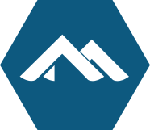 | https://github.com/alpinelinux/alpine-mksite/blob/18f7a137/_static/alpinelinux-logo-icon.svg
Amazon |  |  | http://www.turnerduckworth.com/work/amazon/
Amazon Alexa |  |  | https://developer.amazon.com/docs/alexa-voice-service/logo-and-brand.html
Amazon Simple Storage Service |  | 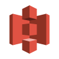 | https://aws.amazon.com/architecture/icons/
Amber Framework |  | 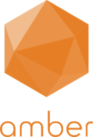 | https://amberframework.org/media
andOTP |  |  | https://github.com/andOTP/andOTP
Android |  |  | https://developer.android.com/distribute/marketing-tools/brand-guidelines.html
AngelList |  |  | https://angel.co/logo
Angular |  |  | https://angular.io/presskit
Ansible |  | 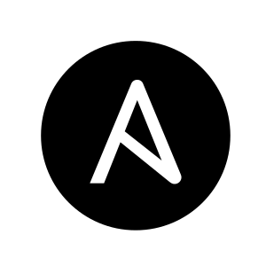 | https://www.ansible.com/logos
Apache AGE |  |  | https://www.apache.org/logos/
Apereo Foundation |  | 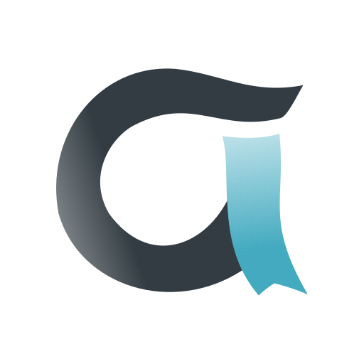 | https://www.apereo.org
Apple |  |  | https://developer.apple.com/softwarelicensing/agreements/pdf/mac_logo_gdlns.pdf
Apple Music |  |  | https://www.apple.com/in/apple-music/
Apple Podcasts |  |  | https://www.apple.com/legal/intellectual-property/guidelinesfor3rdparties.html
Arch Linux |  |  | https://commons.wikimedia.org/wiki/File:Archlinux-icon-crystal-64.svg
Atom |  | 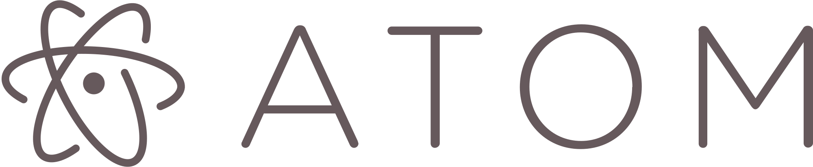 | https://atom.io/
Auth0 |  |  | https://auth0.com/blog/branding-updates/
Authy |  |  | https://support.authy.com/hc/en-us#
Azure |  |  | 
Backbone |  |  | https://backbonejs.org/
Badoo |  |  | https://badoo.com/
Baidu |  |  | http://www.baidu.com/img/bd_logo1.png
Bandcamp |  |  | https://bandcamp.com/buttons
Bash |  | 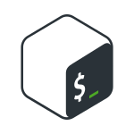 | https://github.com/odb/official-bash-logo
Behance |  | 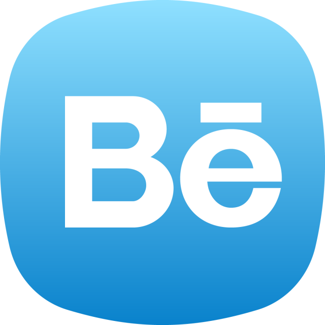 | https://www.behance.net/
Bing |  |  | https://query.prod.cms.rt.microsoft.com/cms/api/am/binary/RE1q9FS
Bitbucket |  |  | https://www.atlassian.com/company/news/press-kit
Bitcoin |  |  | https://commons.wikimedia.org/wiki/File:Bitcoin.svg
Bitwarden |  |  | https://github.com/bitwarden/brand
Blender |  |  | https://www.blender.org/
Blogger |  |  | https://www.blogger.com/img/blogger-logotype-color-black-2x.png
Bluesky |  |  | https://docs.bsky.app/
Bluetooth |  | 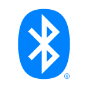 | https://www.bluetooth.com/develop-with-bluetooth/marketing-branding
Brave |  |  | https://brave.com/brave-branding-assets/
Briar |  |  | 
Buffer |  | 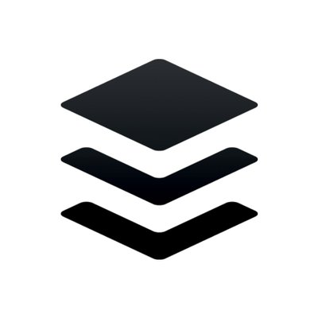 | https://buffer.com/press
Bugcrowd |  |  | 
Bun |  |  | https://bun.sh/
C |  |  | 
Calendar |  |  | https://medium.com/@theunitedindian200/2024-a-leap-year-e71c01bd293f
CentOS |  |  | https://wiki.centos.org/ArtWork/Brand/Logo
Chrome |  |  | https://www.google.com/chrome/static/images/chrome-logo.svg
Chromium |  |  | https://www.chromium.org/
Citrix |  |  | https://brand.citrix.com/brand-system/logo/
Citrix |  |  | https://brand.citrix.com/brand-system/compact-mark/
Clojure |  |  | https://clojure.org/index
Cloudflare |  |  | https://www.cloudflare.com/logo/
Codeberg |  |  | https://codeberg.org/img/logo.svg
CodePen |  |  | https://blog.codepen.io/documentation/logos/
Coderwall |  |  | https://coderwall.com/tos
CoffeeScript |  |  | http://coffeescript.org/
Coil |  | 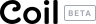 | https://coil.com/
coinpot |  |  | 
Google Colab |  |  | https://colab.research.google.com
C++ |  |  | https://isocpp.org/home/terms-of-use
Crystal |  |  | https://crystal-lang.org/media/
CSS3 |  |  | 
Dart |  | 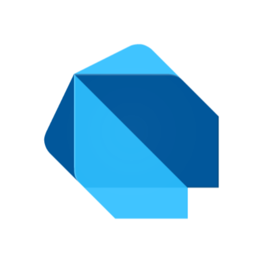 | https://dart.dev/brand
DataCamp |  | 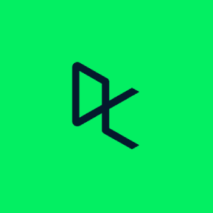 | https://www.datacamp.com/
Debian |  |  | https://www.debian.org/logos/
Deezer |  | 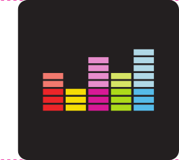 | https://deezerbrand.com/
Delicious |  |  | https://del.icio.us/static/img/logo_delicious_sprite.png
dev.to |  |  | https://dev.to/p/badges
DeviantArt |  | 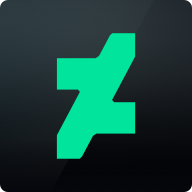 | https://www.deviantart.com/
Digidentity |  | 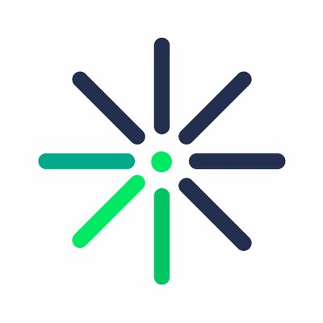 | https://www.digidentity.eu/en/blog/
DigitalOcean |  | 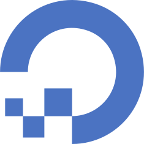 | https://www.digitalocean.com/company/logos-and-badges/
Discord |  |  | https://discordapp.com/branding
Disqus |  |  | https://disqus.com/brand/
Django Project |  |  | https://djangoproject.org/trademarks/
Docker |  |  | https://www.docker.com/brand-guidelines
Draw.io |  |  | https://github.com/jgraph/drawio/blob/v27.1.6/src/main/webapp/images/drawlogo-color.svg
Dribble |  |  | https://dribbble.com/branding
Drone |  |  | https://github.com/drone/brand
Dropbox |  | 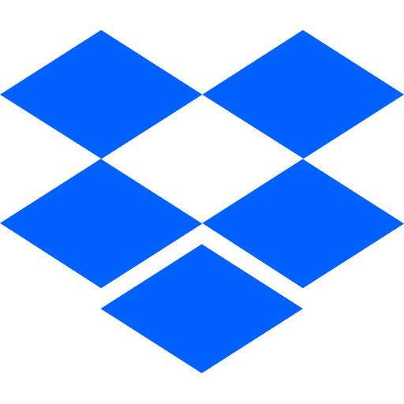 | https://www.dropbox.com/branding
Drupal |  | 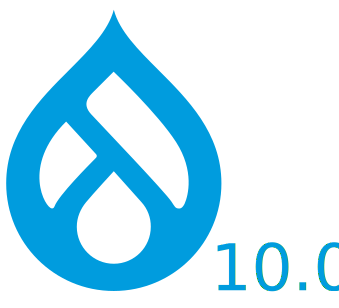 | https://www.drupal.org/about/media-kit/logos
Drupal |  | 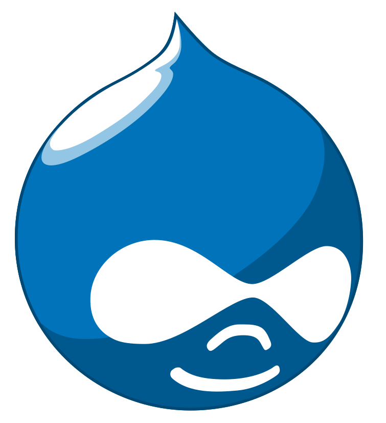 | https://www.drupal.org/about/media-kit/logos
DuckDuckGo |  |  | https://duckduckgo.com/press
Electronic Arts |  |  | https://commons.wikimedia.org/wiki/File:EA-Logo.svg
eBay |  |  | https://go.developer.ebay.com/logos
Ecosia |  | 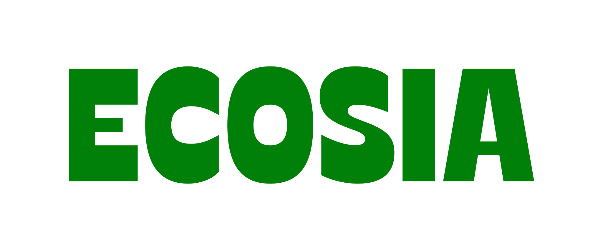 | https://ecosia.co/ecosialogos
Edge |  |  | https://www.microsoft.com/en-us/edge
elastic |  |  | https://www.elastic.co
Element |  | 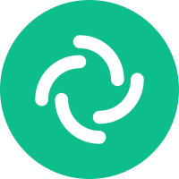 | https://element.io/images/logo-mark-primary.svg
Elementary OS |  | 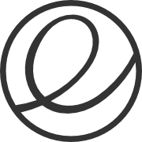 | https://elementary.io/images/brand/logomark.png
Email |  |  | https://commons.wikimedia.org/wiki/File:Mail_%28iOS%29.svg
Endeavour OS |  |  | https://github.com/endeavouros-team/endeavouros-theming
ePub |  |  | http://idpf.org/sites/default/files/epub-logo.gif
Espressif |  |  | 
Ethereum |  |  | https://www.ethereum.org/
Etsy |  |  | https://www.etsy.com/uk/press?ref=ftr
Evernote |  |  | https://evernote.com/media/pdf/evernote_quick_brand_guidelines.pdf
ExpressionEngine |  | 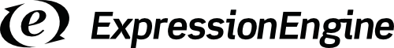 | https://expressionengine.com/about/trademark-use-policy
F-Droid |  |  | https://gitlab.com/fdroid/fdroid-website/-/blob/master/assets/fdroid-logo.svg
Facebook |  |  | https://en.facebookbrand.com/
Fediverse |  |  | https://commons.wikimedia.org/wiki/File:Fediverse_logo_proposal.svg
Filestash |  |  | https://www.filestash.app/
Finder |  |  | https://support.apple.com/en-us/HT201732/
Firefox |  |  | https://mozilla.design/firefox/logos-usage/
Flattr |  |  | https://commons.wikimedia.org/wiki/File:Flattrlogo250.svg
Flickr |  |  | https://www.flickr.com/images/opensearch-flickr-logo.png
Floatplane |  |  | https://www.floatplane.com/
Flutter |  |  | https://flutter.dev/brand
foobar2000 |  |  | https://www.foobar2000.org/
FreeBSD |  |  | https://freebsdfoundation.org/about-us/about-the-foundation/project/
freeCodeCamp |  |  | https://design-style-guide.freecodecamp.org
Friendica |  |  | https://github.com/friendica/friendica/tree/develop/images
Fritz! |  |  | https://en.wikipedia.org/wiki/Fritz!Box#/media/File:Fritz!.svg
Gandi |  | 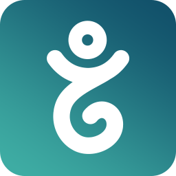 | https://v4.gandi.net/static/images/illustrations/press/Gandi_LogoGuidelines_EN.pdf
GateHub |  | 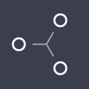 | https://gatehub.net/
Gemini |  |  | https://deepmind.google/technologies/gemini/
Ghost |  |  | https://ghost.org/design/
Git |  |  | https://git-scm.com/downloads/logos
Gitea |  | 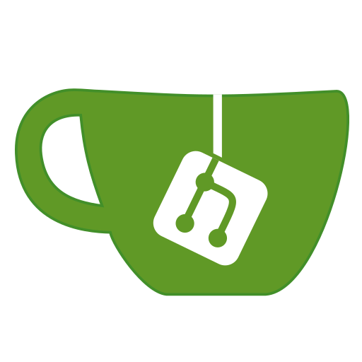 | https://github.com/go-gitea/gitea/tree/master/assets
GitHub |  |  | https://github.com/logos
GitLab |  | 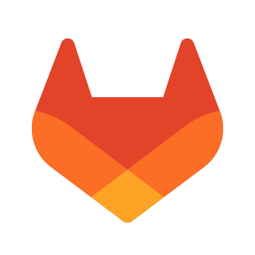 | https://about.gitlab.com/press/
Gitpod |  |  | https://www.gitpod.io/media-kit
Glitch |  |  | https://glitch.com/about/press/
Gmail |  |  | https://www.blog.google/press/
Go |  |  | https://blog.golang.org/go-brand
Godot |  | 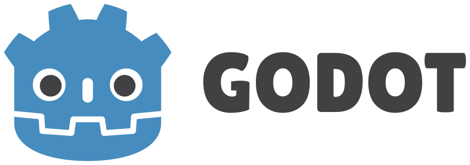 | https://godotengine.org/press/
GOG.com |  |  | https://www.cdprojekt.com/en/media/logotypes/
Gojek |  |  | https://www.gojek.com/id/terms-of-service/
Goodreads |  |  | https://www.goodreads.com/about/press
Google |  |  | https://developers.google.com/identity/branding-guidelines
Google Assistant |  |  | https://www.blog.google/press/
Google Calendar |  |  | https://www.blog.google/press/
Google Collaborative content tools |  |  | https://www.blog.google/press/
Google Drive |  |  | https://developers.google.com/drive/api/v2/branding
Google Maps |  |  | https://www.google.com/maps/about/
Google Meet |  |  | https://www.blog.google/press/
Google Play |  |  | https://play.google.com/intl/en_us/badges/
Google+ |  |  | https://plus.google.com/+googleplus
Google Podcasts |  |  | https://play.google.com/store/apps/details?id=com.google.android.apps.podcasts&hl=en_GB
Google Scholar |  |  | https://scholar.google.com/
Gradle |  |  | 
Grafana |  |  | https://github.com/grafana/grafana/blob/master/public/img/grafana_icon.svg
GraphQL |  |  | https://graphql.org/brand/
Grok |  |  | https://x.ai/legal/brand-guidelines
Guacamole |  |  | https://www.apache.org/logos/?#guacamole
Guilded |  |  | https://www.guilded.gg/brand
h-card |  |  | https://indieweb.org/IndieWebCamp:Copyrights
h-entry |  |  | https://indieweb.org/IndieWebCamp:Copyrights
h-feed |  |  | https://indieweb.org/IndieWebCamp:Copyrights
Hacker News |  |  | https://www.ycombinator.com/favicon.ico
HackerOne |  |  | https://www.hackerone.com/branding
HAML |  |  | https://github.com/haml/haml/issues/819
Heroku |  |  | https://brand.heroku.com/
Homekit |  | 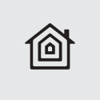 | https://developer.apple.com/design/human-interface-guidelines/homekit/overview/icons/
HP |  |  | https://www.hp.com/
HTML5 |  |  | https://www.w3.org/html/logo/
Hulu |  |  | https://thisis.hulu.com/#hulu-logo
Humble Bundle |  | 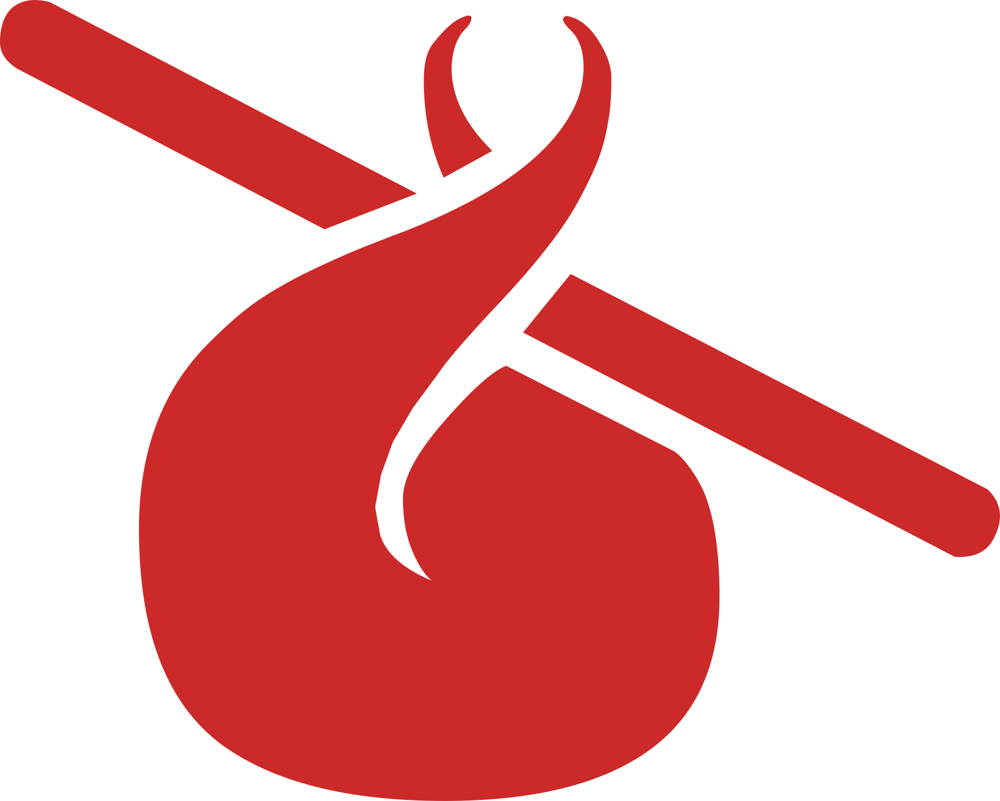 | https://cdn.worldvectorlogo.com/logos/humblebundle.svg
i18next |  |  | https://www.i18next.com/
IBM |  |  | https://www-03.ibm.com/ibm/history/exhibits/logo/logo_8.html
iHeartRadio |  | 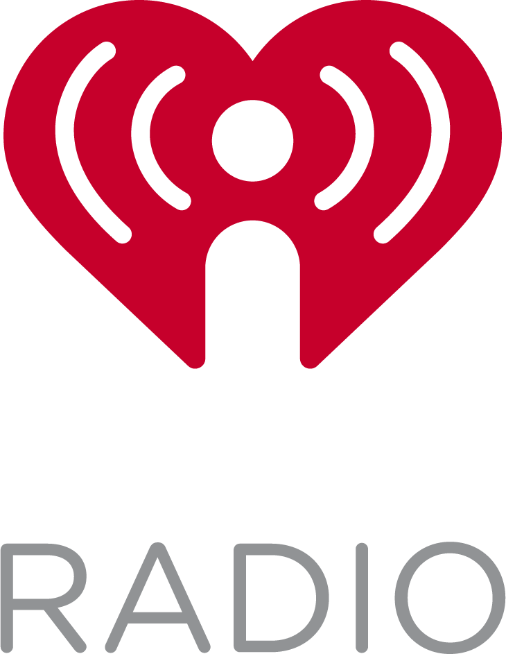 | https://www.iheart.com/
IMDb |  |  | https://imdb.com/
Imgur |  |  | https://imgurinc.com/press
Instagram |  |  | https://en.instagram-brand.com/
Intel |  |  | https://www.intel.com/content/www/us/en/company-overview/visual-brand-identity.html
Intercom |  |  | https://www.intercom.com/press
Internet Archive |  |  | https://commons.wikimedia.org/wiki/File:Internet_Archive_logo_and_wordmark.svg
itch.io |  |  | https://itch.io/press-kit
iTunes |  |  | https://www.apple.com/itunes/marketing-on-podcasts/identity-guidelines.html
Jacobin |  |  | https://www.jacobinmag.com/contact
Java |  |  | http://www.oracle.com/us/technologies/java/java-licensing-logo-guidelines-1908204.pdf
JavaScript |  |  | https://commons.wikimedia.org/wiki/File:Unofficial_JavaScript_logo_2.svg
Jellyfin |  |  | https://raw.githubusercontent.com/jellyfin/jellyfin-web/master/src/assets/img/banner-dark.png
jQuery |  |  | https://brand.jquery.org/logos
JSON-LD |  | 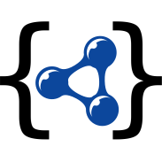 | https://json-ld.org/images/
JSON |  |  | https://json.org/
JSON Feed |  |  | https://www.jsonfeed.org/
JSR |  |  | https://jsr.io/
Julia |  |  | https://julialang.org
JustGiving |  | 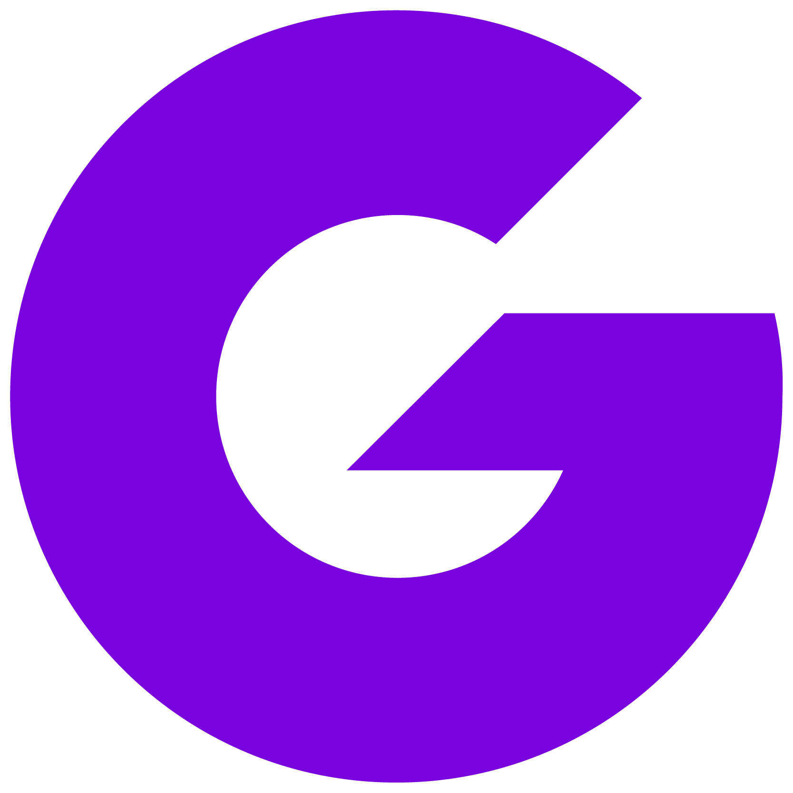 | https://justgiving-developer.zendesk.com/hc/en-us/articles/14308756536337
Kaggle |  |  | https://www.kaggle.com/
KeePassDX |  |  | https://www.keepassdx.com/
Kemal Framework |  | 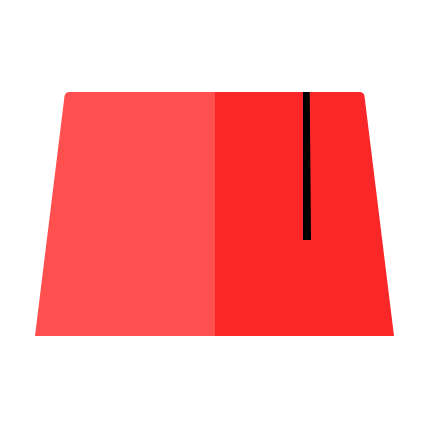 | https://raw.githubusercontent.com/kemalcr/kemalcr.com/master/img/kemal.png
Keskonfai |  |  | https://www.keskonfai.fr/
Keybase |  |  | https://github.com/keybase/client/blob/master/shared/images/iconfont/kb-iconfont-keybase-16.svg
Kickstarter |  | 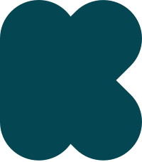 | https://www.kickstarter.com/help/brand_assets
Ko-Fi |  | 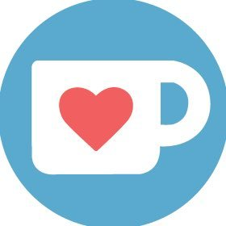 | https://ko-fi.com/
Kodi |  |  | https://kodi.tv/
Kotlin |  |  | https://resources.jetbrains.com/storage/products/kotlin/docs/kotlin_logos.zip
Laravel |  |  | https://github.com/laravel/art/blob/master/Laravel-l-slant.svg
LastPass |  |  | https://lastpass.com/press-room/
LeetCode Logo |  |  | https://leetcode.com/
Liberapay |  |  | https://github.com/liberapay/liberapay.com/blob/master/www/assets/liberapay/icon-v2_yellow-r.svg
LibreSpeed |  | 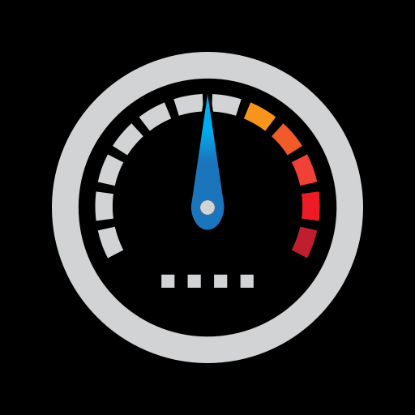 | https://github.com/librespeed/speedtest/blob/master/.logo/LibreSpeed.svg
LINE |  |  | https://line.me/en/logo
Linear |  |  | https://linear.app/brand
LinkedIn |  |  | https://brand.linkedin.com/
Linux |  |  | https://www.linuxfoundation.org/trademark-usage/
Linux Mint |  |  | https://commons.wikimedia.org/wiki/File:Linux_Mint_logo_without_wordmark.svg
LinuxContainers |  | 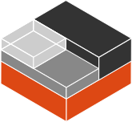 | https://github.com/lxc/linuxcontainers.org/blob/10c399c/static/img/containers.svg
Lobste.rs |  |  | https://lobste.rs/
Lock |  |  | https://www.freepik.com/icon/lock_449932
Logitech |  | 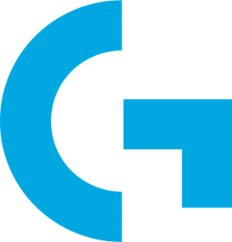 | https://www.logitech.com/en-au
Lucky Framework |  | 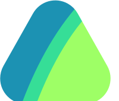 | https://luckyframework.org/
macOS |  |  | https://www.apple.com/mac/
Mail |  |  | https://www.flaticon.com/free-icon/at-sign_9192388
Mailchimp |  |  | https://mailchimp.com/about/brand-assets/
Malt |  |  | 
Manjaro |  |  | https://manjaro.org/img/logo.svg
Markdown |  | 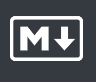 | https://www.markdownguide.org/
mastercard |  |  | https://www.mastercard.com/global/en.html
Mastodon |  |  | https://github.com/tootsuite/joinmastodon/blob/master/public/press-kit.zip
matrix |  |  | 
Mattermost |  |  | https://www.mattermost.org/brand-guidelines/
McDonald's |  |  | https://corporate.mcdonalds.com/corpmcd/our-stories/media-assets-library/media-article/golden_arches_logo.html
Medium |  |  | https://medium.design/logos-and-brand-guidelines-f1a01a733592
Meetup |  | 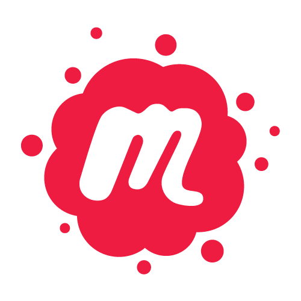 | https://a248.e.akamai.net/secure.meetupstatic.com/photos/event/8/f/1/d/highres_454596637.jpeg
Messenger |  |  | https://en.facebookbrand.com/assets/messenger/
microformats |  |  | 
micropython |  |  | https://upload.wikimedia.org/wikipedia/commons/a/a5/MicroPython_new_logo.jpg
Microsoft |  |  | https://news.microsoft.com/mssurfacehub_logo_stacked_c-white_rgb/
Minecraft |  |  | https://account.mojang.com/terms
MongoDB |  | 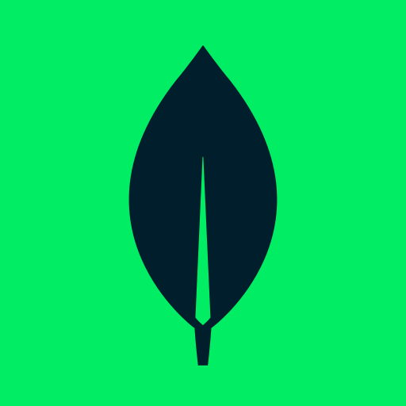 | https://www.mongodb.com/brand-resources
MySQL |  |  | https://www.mysql.com/about/legal/logos.html
NetBeans |  | 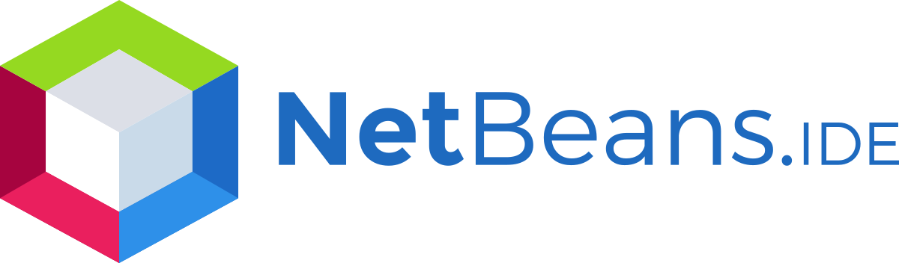 | https://www.apache.org/logos/res/netbeans/netbeans.png
NetBSD |  |  | https://www.netbsd.org/gallery/logos.html
Netflix |  | 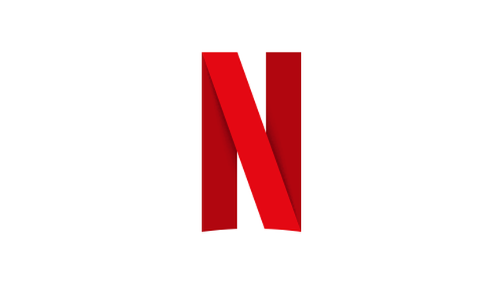 | https://brand.netflix.com/en/assets/brand-symbol/
NextCloud |  | 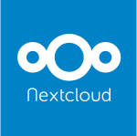 | https://nextcloud.com/press/
NGINX |  |  | https://www.nginx.com/
NHS |  |  | https://www.england.nhs.uk/nhsidentity/identity-guidelines/nhs-logo/
NixOS |  |  | https://github.com/NixOS/nixos-artwork/blob/master/logo/README.md
Node.js |  |  | https://nodejs.org/static/documents/foundation-visual-guidelines.pdf
npm |  |  | https://github.com/npm/logos
OK.ru |  |  | https://insideok.ru/brandbook
Olympic Rings |  |  | 
OnlyFans |  | 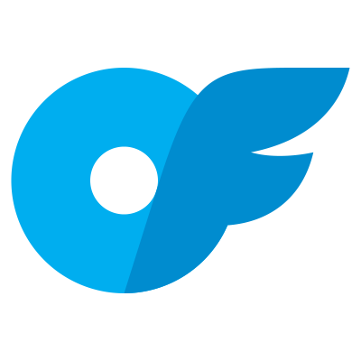 | https://onlyfans.com/brand
OpenBenches |  |  | https://openbenches.org/
Open Bug Bounty |  |  | https://www.openbugbounty.org
Opencast |  |  | http://www.opencast.org/
Open Collective |  |  | https://docs.opencollective.com/help/about/introduction#media-logo
OpenCores |  |  | https://opencores.org
Open Source |  |  | https://opensource.org/logo-usage-guidelines
OpenStreetMap |  | 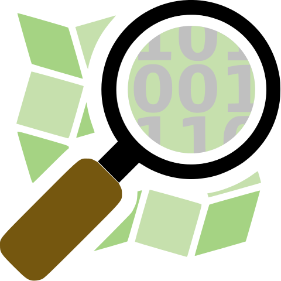 | https://wiki.openstreetmap.org/wiki/Logos#Other_logos
OpenVPN |  |  | https://openvpn.net/
Opera |  |  | https://brand.opera.com/1472-2/opera-logos/
Orcid |  |  | https://orcid.org/
Origin |  | 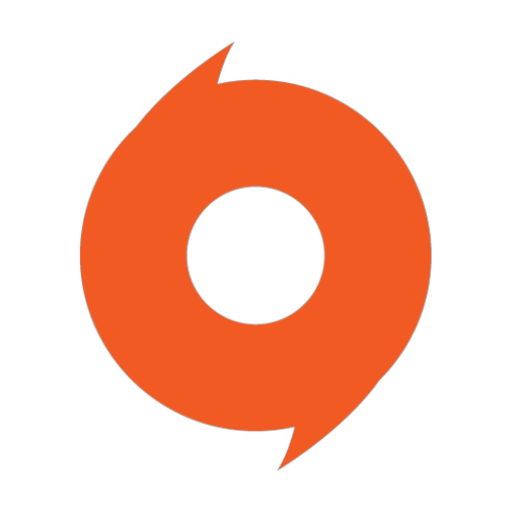 | https://www.origin.com/
Outlook |  |  | https://ow2.res.office365.com/owalanding/2021.8.25.01/images/outlook-icon.jpg
Overcast |  |  | https://overcast.fm
Overleaf |  |  | https://www.overleaf.com/for/partners/logos
Patreon |  |  | https://www.patreon.com/brand/guidelines
PayPal |  |  | https://www.paypal-marketing.com/html/partner/na/pdf/PayPal_Cobranding_guidelines_dec_2013.pdf
PDF |  |  | https://www.adobe.com/content/dam/acom/en/legal/documents/Adobe_Trademark_Guidelines_11012014.pdf
PeerTube |  |  | https://joinpeertube.org
Phone |  |  | https://iconscout.com/free-icon/apple-phone-2
PHP |  |  | https://secure.php.net/download-logos.php
Pinboard |  |  | https://twitter.com/pinboard
Pinterest |  |  | https://business.pinterest.com/en-gb/brand-guidelines
Pixelfed |  |  | https://pixelfed.org/
Plausible |  |  | https://github.com/plausible/docs/blob/b18114e6/static/img/plausible_logo.svg
PlayStation |  |  | https://www.playstation.com/en-gb/
Plex |  |  | http://brand.plex.tv/d/qxmJ3odkK0fj/plex-style-guide
Pocket |  |  | https://blog.getpocket.com/press/
Pocket Casts |  |  | https://static2.pocketcasts.com/assets/pc_press_kit.zip
Pop!_OS |  |  | 
Pornhub |  |  | https://www.pornhub.org/press
Postman |  |  | https://www.postman.com/company/press-media/#:~:text=Logo%20guidelines,process%20and%20submit%20a%20requ
PowerShell |  |  | https://learn.microsoft.com/en-us/powershell/scripting/community/digital-art?view=powershell-7.3
Preact |  |  | https://preactjs.com
Printer |  |  | https://www.iconfinder.com/icons/326675/print_icon#size=512
Proton Mail |  |  | https://protonmail.com/media-kit
Python |  |  | https://www.python.org/community/logos/
QQ |  |  | http://www.imqq.com/English1033.html
quora |  |  | https://www.quora.com/
R |  |  | https://www.r-project.org/logo/
Raspberry Pi |  |  | https://www.raspberrypi.org/trademark-rules/
React |  |  | https://github.com/facebook/react/blob/master/fixtures/dom/public/react-logo.svg
Reddit |  |  | https://web.archive.org/web/20160306165444/https://www.reddit.com/about/alien/
RedHat |  |  | https://www.redhat.com/
Research Gate |  |  | https://mobile.twitter.com/ResearchGate/photo
Rockstar Games |  |  | https://www.rockstargames.com/
Roundcube |  |  | https://roundcube.net/images/roundcube_logo_icon.svg
RSS |  |  | http://www.feedicons.com/
Ruby |  |  | https://www.ruby-lang.org/en/about/logo/
Ruby Gems |  |  | https://rubygems.org
Ruby On Rails |  |  | https://rubyonrails.org/trademarks/
Rust |  |  | https://www.rust-lang.org/policies/media-guide
Safari |  |  | https://www.apple.com/uk/safari/
Samsung |  |  | https://commons.wikimedia.org/wiki/File:Samsung_Logo.svg
Samsung Internet |  |  | https://commons.wikimedia.org/wiki/File:Samsung_Internet_logo.svg
Samsung |  |  | https://www.svgrepo.com/svg/349501/samsung-s
Samsung |  |  | https://www.samsung.com/in/?srsltid=AfmBOorcWZ_DcTEx1whMJ4bv9Y6BTBISGULV7GzsMNk5GvF1PWDxyrrj
Sass |  |  | https://sass-lang.com/styleguide/brand
Semantic Web |  |  | https://www.w3.org/2007/10/sw-logos.html
Semaphore CI |  |  | https://twitter.com/semaphoreci
Sentry |  |  | https://sentry.io/branding/
Signal |  |  | https://signal.org/
Sketch |  |  | https://www.sketchapp.com/
Skype |  |  | https://www.skype.com/en/legal/brand-guidelines/
Slack |  |  | https://slack.com/media-kit
SlideShare |  |  | https://www.slideshare.net/about/logos
Snapchat |  |  | https://www.snap.com/en-US/brand-guidelines/
SOGo |  |  | https://www.sogo.nu/
Solidity |  |  | https://docs.soliditylang.org/en/latest/brand-guide.html
SoundCloud |  |  | https://developers.soundcloud.com/docs/api/buttons-logos
SPARQL |  |  | https://cygri.github.io/rdf-logos/
Spotify |  |  | https://developer.spotify.com/design/
Square Cash |  |  | https://squareup.com/us/en/press
Stack Exchange |  |  | https://stackoverflow.com/company/logos
Stack Overflow |  |  | https://stackoverflow.com/company/logos
Steam |  |  | https://steamcdn-a.akamaihd.net/steamcommunity/public/images/steamworks_docs/english/Steam_Guidelines_20170524.pdf
Stitcher |  |  | https://itunes.apple.com/us/app/stitcher-for-podcasts/id288087905
Strava |  |  | https://www.strava.com/settings/badges
StumbleUpon |  |  | https://en.wikipedia.org/wiki/StumbleUpon#/media/File:StumbleUpon_Logo.svg
Sublime Merge |  |  | https://www.sublimehq.com/
Sublime Text |  |  | https://www.sublimetext.com/
SubscribeStar |  |  | https://www.subscribestar.com/brand
Svelte |  |  | https://github.com/sveltejs/branding
SVG |  |  | https://www.w3.org/Graphics/SVG/
Swift |  |  | https://developer.apple.com/swift/resources/
Symantec |  |  | https://www.symantec.com/about/newsroom/digital-asset-gallery/logos
Symfony |  |  | https://symfony.com/logo
taiga.io |  |  | 
tailwindCss |  |  | https://tailwindcss.com/brand
TATA |  |  | https://www.tata.com/
Teamspeak |  |  | https://www.teamspeak.com/en/
Telegram |  |  | https://telegram.org/tour/screenshots
TensorFlow |  |  | https://www.tensorflow.org/extras/tensorflow_brand_guidelines.pdf
Terraform |  |  | https://www.terraform.io/logos.html
This American Life |  |  | https://www.npr.org/about-npr/179876898/terms-of-use
Threads |  |  | https://en.wikipedia.org/wiki/File:Threads_(app)_logo.svg
Threema |  |  | https://threema.ch/en/press
TikTok |  |  | https://www.tiktok.com
Todoist |  |  | https://doist.com/press
Tox |  |  | https://github.com/Tox/tox.chat/blob/master/themes/website/static/img/icon.svg
Trello |  |  | https://www.atlassian.com/company/news/press-kit
TripAdvisor |  |  | https://tripadvisor.mediaroom.com/download/TheNewTripAdvisor_StyleGuide.pdf
Tumblr |  |  | https://www.tumblr.com/logo
TuneIn |  |  | https://cms.tunein.com/wp-content/uploads/2018/08/TuneIn-Media-Kit-Q3-2018-.pdf
Tutanota |  |  | 
Twilio |  |  | https://www.twilio.com/marketing/bundles/company-brand/resources/Twilio-Logos.zip
Twitch |  |  | https://www.twitch.tv/p/brand/
Twitter |  |  | https://about.twitter.com/en/who-we-are/brand-toolkit
TypeScript |  |  | 
Uber |  |  | https://brand.uber.com/guide#logo-clearspace
Ubiquiti |  |  | https://pbs.twimg.com/profile_images/862701781368713216/B7oW421__400x400.jpg
Ubisoft |  |  | https://icon-icons.com/download/136078/PNG/512/
Ubuntu |  |  | https://design.ubuntu.com/brand/ubuntu-logo/
Udemy |  |  | 
Unicode |  |  | https://www.unicode.org/policies/logo_policy.html
Untappd |  |  | https://commons.wikimedia.org/wiki/File:Untappd.svg
Uphold |  |  | https://uphold.com/en/press-media
Vagrant |  |  | https://www.vagrantup.com/files/press-kit.zip
Vegetarian |  |  | https://www.v-label.com/
Venmo |  |  | https://venmo.com/about/brand
Viber |  |  | https://www.viber.com/en/
VictoriaMetrics |  |  | https://github.com/VictoriaMetrics/VictoriaMetrics/blob/v1.119.0/VM_logo.zip
Vim |  |  | https://www.vim.org/logos.php
Vimeo |  |  | https://press.vimeo.com/brand-guidelines
visa |  |  | https://www.merchantsignage.visa.com/brand_guidelines
Visual Studio Code |  |  | https://code.visualstudio.com/brand
Vivino |  |  | https://www.vivino.com/press
VK |  |  | https://vk.com/public47200950
VLC |  |  | https://www.videolan.org/
Vue |  |  | https://github.com/vuejs/art/blob/master/logo.svg
W3C |  |  | https://www.w3.org/Consortium/Legal/logo-usage-20000308
Wayland |  |  | https://wayland.freedesktop.org/
WebAssembly |  |  | https://webassembly.org/
WebMention |  |  | https://indieweb.org/File:webmention-logo.svg
WebToons |  |  | https://www.webtoons.com/en
WeChat |  |  | https://wechat.design/?locale=en_US
Wekan |  |  | https://github.com/wekan/wekan/blob/master/public/wekan-logo-150.svg
WhatsApp |  |  | https://www.whatsappbrand.com/
WHATWG |  |  | https://whatwg.org/ipr-policy
WiFi |  |  | https://www.wi-fi.org/download.php?file=/sites/default/files/private/Wi-Fi_Alliance_Brand_Styleguide_201709.pdf
Wikipedia |  |  | https://wikimediafoundation.org/wiki/Visual_identity_guidelines
Windows |  |  | https://query.prod.cms.rt.microsoft.com/cms/api/am/binary/RE1voQq
Wire |  |  | https://brand.wire.com/symbol/
WireGuard |  |  | https://www.wireguard.com/img/emblem-circle.svg
WordPress |  |  | https://wordpress.org/about/logos/
Workato |  |  | https://workato.com
X |  |  | https://about.twitter.com/en/who-we-are/brand-toolkit
X11 |  |  | https://www.netbsd.org/gallery/logos.html
XING |  |  | https://dev.xing.com/logo_rules
XMPP |  |  | https://xmpp.org/about/press-kit/
Yahoo! |  |  | https://www.pentagram.com/work/yahoo/story
YAML |  |  | https://yaml.org/favicon.svg
Yammer |  |  | https://yammerassets.blob.core.windows.net/assets/sites/12/2014/07/Yammer_BrandIdentityGuidelines-1.pdf
Yarn |  |  | https://yarnpkg.com/en/
Yelp |  |  | https://www.yelp.co.uk/brand
Yii |  |  | https://www.yiiframework.com/logo
YouTube |  |  | https://www.youtube.com/intl/en/yt/about/brand-resources/#logos-icons-colors
Yubico |  |  | https://github.com/Yubico/yubikey-manager-qt/blob/master/resources/icons/ykman.png
Zoom |  |  | https://www.zoom.us/
Zorinos |  |  | https://zorin.com/press/
<h2>No Reference Image Found</h2>

Name | Icon | Filename
-|-|-
GeeksForGeeks |  | geeksForGeeks.svg 
Gmail |  | gmail_old.svg 
Google Docs Editors |  | google_docs_editors.svg 
Google Drive |  | google_drive_old.svg 
Google Maps |  | google_maps_old.svg 
Uplay |  | uplay.svg 
Upwork |  | upwork.svg 
